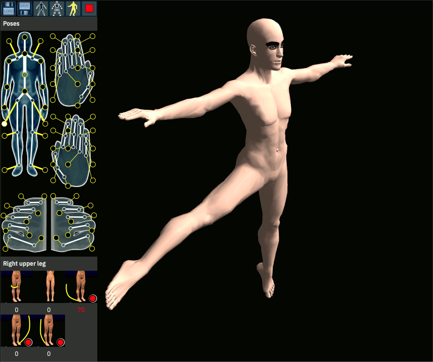

# mh091rc1.js

  

  A variation of [Makehuman](http://www.makehumancommunity.org) 0.9.1-rc1a as a WebApp.

### WHAT

This repository ports parts of Makehuman 0.9.1-rc1a from C++ to Typescript.

The algorithms are described in [Ideas and methods for modeling 3D human figures](https://doi.org/10.1145/1341771.1341782).

Current status: rotate and pose human

### WHY

While this version of MakeHuman is limited when compared to the 1.x versions but features two usefull properties:

* shape keys: fewer artifacts when posing plus muscles change
* constraints: poses are restricted to those of a real body

The later 1.x versions provide much better meshes, morphs, a skeleton and alternative and extra meshes and the face can be posed.

The goal learn about this version of MakeHuman and try to bring lost functionality to my MakeHuman 1.2 port [makehuman.js](https://github.com/markandre13/makehuman.js).

An overview of this implementation is given in

<!--
[ ] clip pose values in ui
[ ] reset
[ ] morph
[ ] some constraints do not work
   [ ] toes
   [ ] 180_right_upper_leg/ROT_BASE3
[ ] how are normals handled (RenderMesh calculates them me thinks, but animorph should be able to do that)
[ ] what does the collada support provide? shapekeys?
[ ] collada, could we export the shapekeys and bind them to a bone?
[ ] just for fun
  [ ] the MH background with the logo
  [ ] uv & texture?
  [ ] subdivision?
  [ ] save/load pose
  [ ] save/load morph
  [ ] export collada
-->
